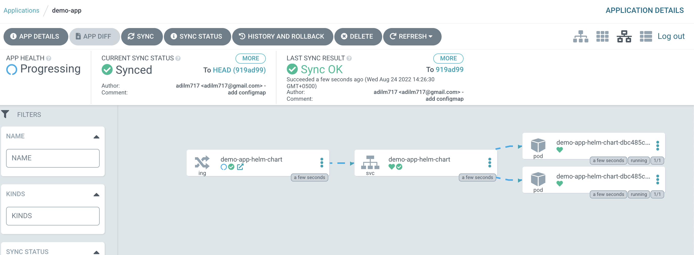

# argocd-demo-app
deploy helm chart with argoCD




# Create app

```shell
argocd app create demo-app --repo https://github.com/Adiii717/argocd-demo-app.git --path helm-chart --dest-namespace default --dest-server https://kubernetes.default.svc --helm-set replicaCount=2
```

# Sync app deployment 

```shell
APP_NAME="$1"
CI_ENVIRONMENT_SLUG="develop"


argocd app create $APP_NAME --repo https://github.com/Adiii717/argocd-demo-app.git --path helm-chart --dest-namespace default --dest-server https://kubernetes.default.svc --helm-set replicaCount=2  --loglevel debug --upsert


argocd app set $APP_NAME --release-name $APP_NAME -p replicaCount=1 -p ingress.hosts[0].host=$APP_NAME.test.com -p ingress.hosts[0].paths[0].path="/" -p ingress.hosts[0].paths[0].pathType="Prefix" -p HOSTED_ON="$APP_NAME"

argocd app sync $APP_NAME --prune
argocd app wait $APP_NAME --timeout 300
```


## ConfigMAp creation

The following chart config map by default as json, to pass the value we need pass value in the form of yaml form in the `values.yaml`

You can convert json to yaml here https://www.json2yaml.com/
```
{
  "json": [
    "rigid",
    "better for data interchange"
  ],
  "yaml": [
    "slim and flexible",
    "better for configuration"
  ],
  "object": {
    "key": "value",
    "array": [
      {
        "null_value": null
      },
      {
        "boolean": true
      },
      {
        "integer": 1
      },
      {
        "alias": "aliases are like variables"
      },
      {
        "alias": "aliases are like variables"
      }
    ]
  },
  "paragraph": "Blank lines denote\nparagraph breaks\n",
  "content": "Or we\ncan auto\nconvert line breaks\nto save space",
  "alias": {
    "bar": "baz"
  },
  "alias_reuse": {
    "bar": "baz"
  }
}
```
yaml

```
json:
  - rigid
  - better for data interchange
yaml: 
  - slim and flexible
  - better for configuration
object:
	key: value
  array:
    - null_value:
    - boolean: true
    - integer: 1
    - alias: &example aliases are like variables
    - alias: *example
paragraph: >
   Blank lines denote

   paragraph breaks
content: |-
   Or we
   can auto
   convert line breaks
   to save space
alias: &foo
  bar: baz
alias_reuse: *foo 
```

